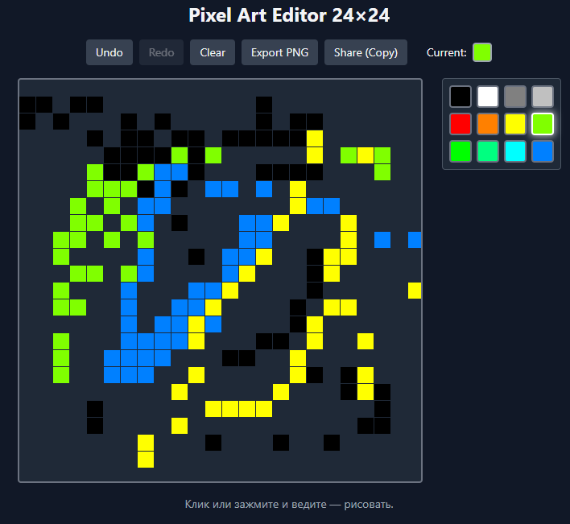

# Pixel Art Editor 24×24

Простой редактор пиксель-арта, созданный на **Vite + React + TypeScript + Tailwind CSS**.
## Демо
🔗 [Открыть редактор](https://pixel-editor-main.vercel.app)


## Возможности
- Сетка 24×24, рисование кликом и перетаскиванием
- Палитра из 12 цветов
- Undo / Redo
- Сохранение в localStorage
- Экспорт PNG и копирование в буфер обмена
- Адаптивный дизайн (тёмная тема)

## Стек
- Vite
- React 18
- TypeScript
- Tailwind CSS v3
- Без дополнительных библиотек для редактора

## Запуск локально

```bash
git clone https://github.com/pbTony-HT/pixel-editor.git
cd pixel-editor
npm install
npm run dev
